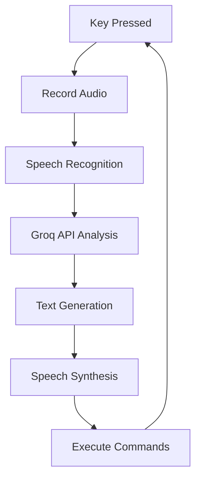

# Groq Voice Assistant


Voice-controlled AI assistant with system interaction capabilities using Groq's API.

## Key Features
- **Hands-free operation** - activate with `INSERT` key
- **Natural language processing** - understands conversational English commands
- **System control** - can launch applications via keyboard emulation
- **Witty personality** - responds with humor and sarcasm
- **Thread-safe operation** - prevents speech conflicts

## Requirements
- Python 3.8+
- Groq API key ([get one here](https://groq.com/))
- Supported LLM model (e.g., `meta-llama/llama-4-scout-17b-16e-instruct`)
- Microphone access

## Installation

### 1. Install Dependencies
```bash
pip install SpeechRecognition pyaudio pyttsx3 openai keyboard pyautogui
```

### 2. Configure API
Set your Groq API key in the script:
```python
client = OpenAI(
    base_url="https://api.groq.com/openai/v1",
    api_key="your_api_key_here"
)
```

## Usage
```bash
python groq_voice.py
```
- Hold `INSERT` key to activate voice input
- Speak naturally in English after activation
- Release key when finished speaking
- Assistant will respond verbally and execute commands

## Supported Commands
The assistant can open these applications:
- **Browsers**: Chrome, Firefox, Tor Browser
- **Messengers**: Telegram, Discord
- **Development**: VS Code
- **Entertainment**: Steam, Spotify

## Technical Details

### Voice Processing
- Uses Google's speech recognition API (English language)
- 15-second timeout for voice input
- 12-second phrase time limit
- Automatic ambient noise adjustment

### System Control
- Emulates Windows key + application name
- 0.7s delay between key presses for reliability
- Error handling for unrecognized applications

### AI Configuration
- Temperature: 0.8 (creative responses)
- Max tokens: 300
- System prompt encourages witty, humorous responses
- Special phrase "On it" indicates command execution

## Workflow


## Configuration Options
- `KEY_TO_HOLD`: Change activation key (default: 'insert')
- `MODEL_NAME`: Change Groq model
- `engine.setProperty('rate', 170)`: Adjust speech speed
- `engine.setProperty('voice', voices[0].id)`: Change TTS voice
- System prompt: Modify AI personality in `process_command()`
- Add more applications in `process_command()` function

## Troubleshooting
- **Microphone issues**: Check device permissions
- **Speech recognition errors**: Reduce background noise
- **Application not opening**: Verify application name in Windows start menu
- **API errors**: Check Groq API key and internet connection
